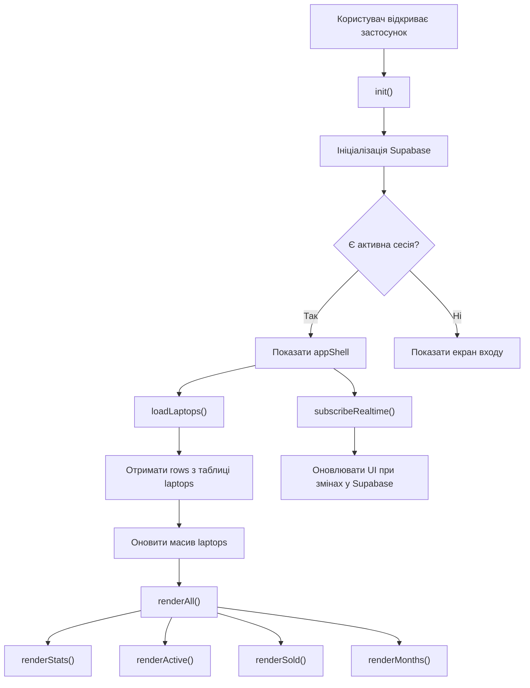
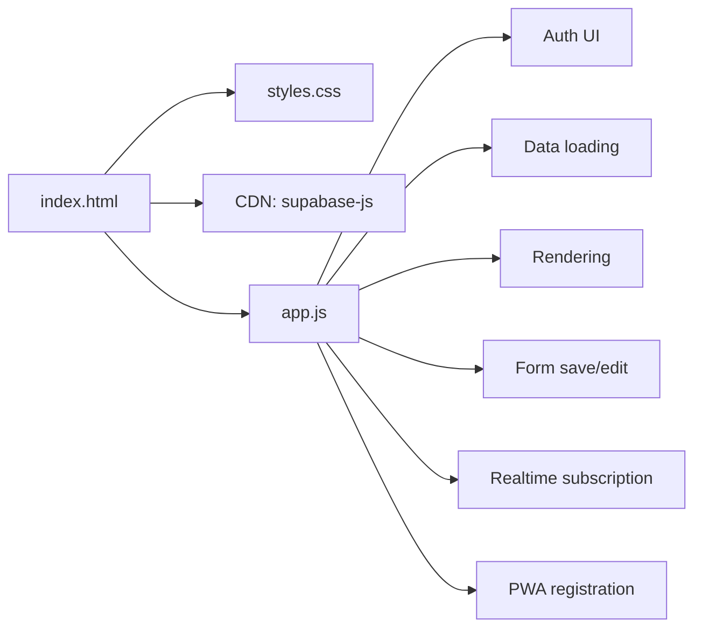

# Ноуток CRM: аудит і схема

## Короткий аудит

### Високий пріоритет

1. Увесь застосунок раніше жив в одному HTML-файлі.
   Це ускладнювало будь-які зміни, перевірку логіки, повторне використання коду й локалізацію помилок.

2. Клієнт напряму працює з Supabase з браузера.
   Це нормально для легкого внутрішнього інструмента, але без уважно налаштованих політик доступу на таблицю `laptops` є ризик небажаного читання або зміни даних.

3. Авторизація, доступ до даних і бізнес-логіка змішані в одному шарі.
   Через це важко окремо тестувати правила переходів статусів, розрахунки собівартості й поведінку інтерфейсу.

### Середній пріоритет

4. PWA реалізовано лише частково.
   `service-worker.js` реєструється, але не кешує сторінку, стилі, JS або дані, тому реальної офлайн-підтримки немає.

5. Схема даних не зафіксована в репозиторії.
   Поля таблиці відомі лише з фронтенду, тому при зміні структури в Supabase легко отримати тихі збої.

6. Частина логіки UI залежить від динамічно створюваних елементів.
   Наприклад, розширені поля редагування створюються на льоту, що ускладнює підтримку й збільшує шанс регресій.

### Низький пріоритет

7. У коді лишилися невикористані або недоведені сценарії.
   Наприклад, `deleteCurrent()` порожня, а функції швидкої зміни статусу й дублювання зараз не прив'язані до явних кнопок у поточному UI.

8. У проєкті немає автоматичних тестів.
   Для поточного масштабу це не критично, але вже зараз варто хоча б винести бізнес-правила в окремі функції й перевіряти їх окремо.

## Що вже покращено

- Стилі винесені в `styles.css`.
- Основна логіка винесена в `app.js`.
- `index.html` перетворений на зрозумілий каркас сторінки.
- Додано реальний `banner` для повідомлень.
- Статус підключення до Supabase тепер відображається у блоці бази.

## Структура даних

Основна сутність: `laptop`

Очікувані поля:

- `id`
- `number`
- `status`
- `ebay_price`
- `ebay_link`
- `delivery_cost`
- `charger_cost`
- `duty_cost`
- `olx_ad_cost`
- `engraving_cost`
- `ssd`
- `ram`
- `serial_number`
- `olx_link`
- `telegram_link`
- `sold_price`
- `sold_at`
- `created_at`

Похідні обчислення:

- `cost = ebay_price + delivery_cost + charger_cost + duty_cost + olx_ad_cost + engraving_cost + ssd + ram`
- `profit = sold_price - cost`

## Правила статусів

- Новий ноутбук завжди створюється як `in_transit`
- `in_transit -> received`
- `received -> sold`
- `sold -> received` дозволено як відкат
- Якщо заповнено `serial_number` і статус не `sold`, запис автоматично переводиться в `received`
- При переході в `sold` обов'язкові `sold_price` і `sold_at`

## Логічна схема

## Схема модулів після рефакторингу

## Наступний здоровий крок

Найкраще продовження після цього рефакторингу:

1. винести конфіг Supabase в окремий конфіг-файл або змінні середовища на рівні деплою
2. формалізувати SQL-схему таблиці `laptops`
3. розбити `app.js` ще хоча б на `auth`, `data`, `render`, `form`
4. додати базову перевірку логіки переходів статусів і розрахунків
